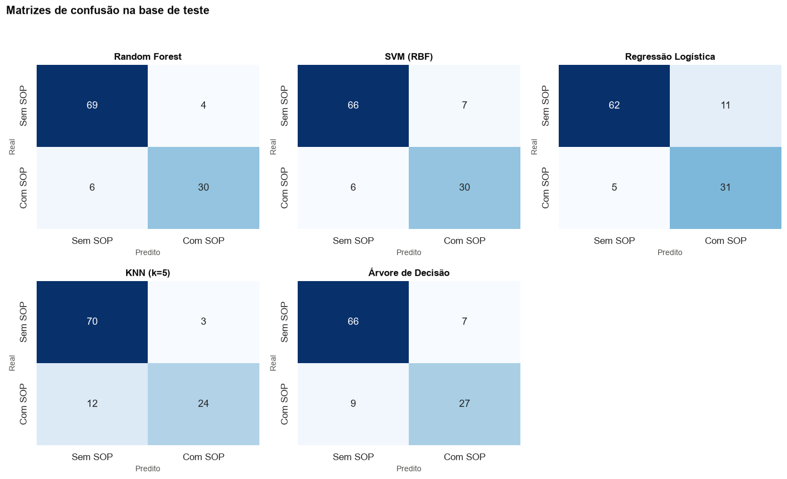
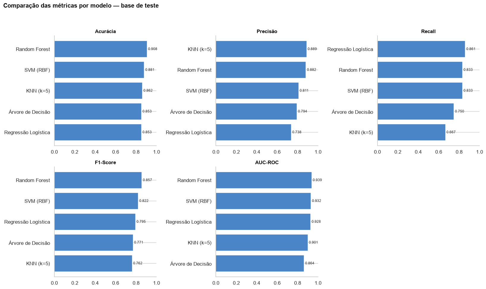
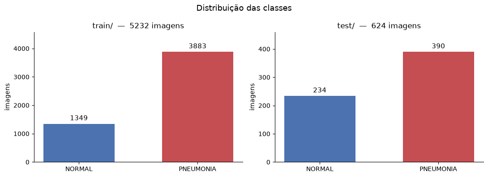
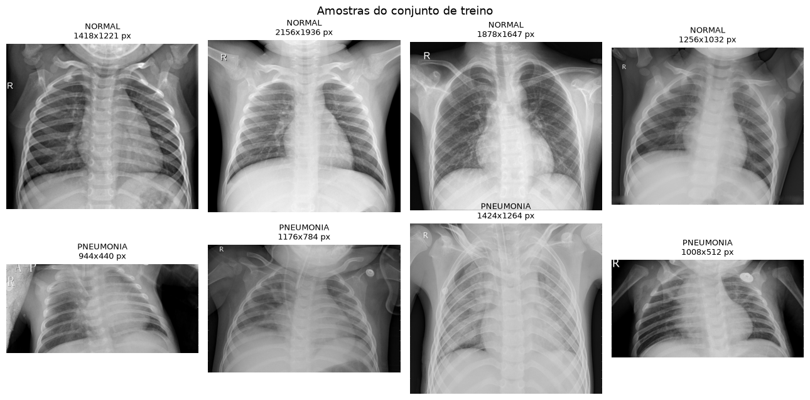
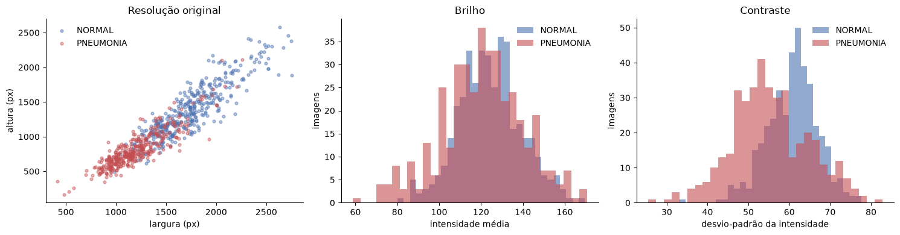
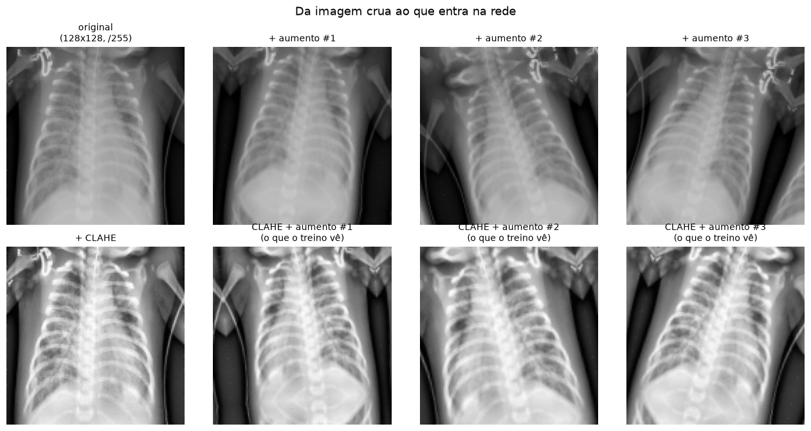
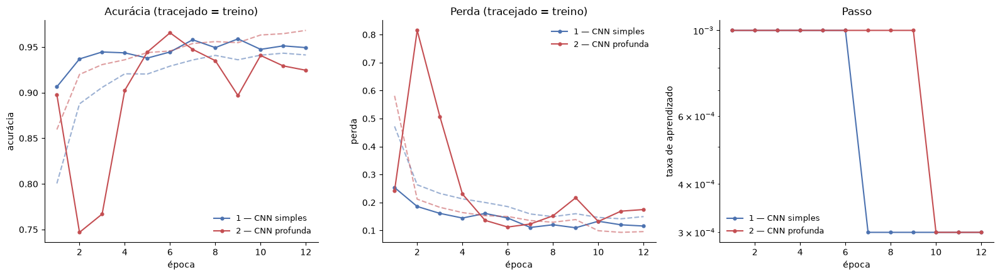
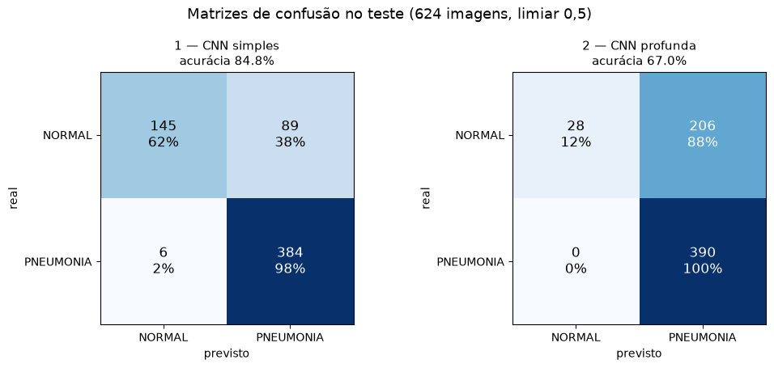
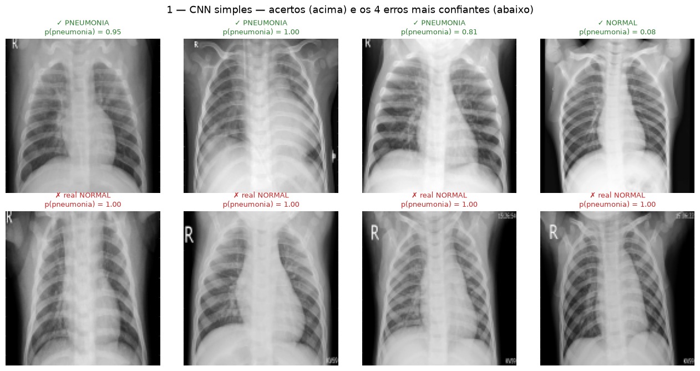
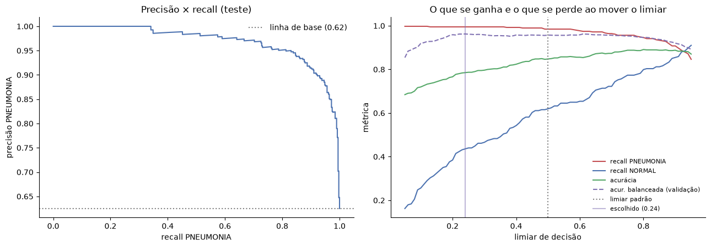

# Documentação — Fase 1 Pós-Tech

## Índice

1. [Relatório 1 — PCOS](#relatorio-1)
2. [Relatório 2 — Pneumonia em raio-X de tórax com rede convolucional](#relatorio-2)

---

<a id="relatorio-1"></a>

## Relatório 1 — PCOS

Este notebook recebe o dataset já tratado (`base_dados_tratada/PCOS_unificado.csv`)
e executa a etapa de **modelagem**: separação treino/teste, treinamento de cinco
classificadores e comparação das métricas.

### Análise Técnica

<a id="etapa3_0"></a>
#### 3.0 — Carregamento e split treino/teste

Localiza a raiz do projeto, lê o CSV unificado e separa 80% para treino e 20% para
teste. O `stratify=y` garante que a proporção de pacientes com e sem SOP seja a
mesma nos dois conjuntos.

Base carregada: 541 linhas x 49 colunas
Features: 46
Treino: 432 registros ({0: 291, 1: 141})
Teste:  109 registros ({0: 73, 1: 36})

<a id="etapa3_1"></a>
#### 3.1 — Pré-processamento

Aplica `StandardScaler` nas colunas numéricas e `OneHotEncoder` na coluna categórica
`Blood Group`. Tudo isso é feito dentro de um `Pipeline` para evitar *data leakage*:
o pré-processador é ajustado apenas no treino e depois aplicado no teste.

<a id="etapa3_2"></a>
#### 3.2 — Modelos candidatos

São testados cinco classificadores com características distintas:

- **Regressão Logística**: rápida, interpretável e com saída probabilística.
- **Árvore de Decisão**: regras explícitas do tipo "se... então".
- **KNN (k=5)**: classifica pelo voto dos vizinhos mais próximos.
- **Random Forest**: conjunto de árvores, geralmente mais robusto.
- **SVM (RBF)**: encontra fronteiras não-lineares entre as classes.

<a id="etapa3_3"></a>
#### 3.3 — Treinamento e métricas

Cada modelo é inserido em um `Pipeline` (pré-processamento + classificador),
treinado na base de treino e avaliado na base de teste.

As métricas escolhidas refletem diferentes aspectos do problema:

- **Acurácia**: acertos gerais.
- **Precisão**: confiabilidade dos diagnósticos positivos.
- **Recall**: capacidade de não deixar casos de SOP passarem.
- **F1-Score**: equilíbrio entre precisão e recall.
- **AUC-ROC**: separação geral entre as classes.

##### Resultados — Métricas na Base de Teste (20%)

| Modelo | Acurácia | Precisão | Recall | F1-Score | AUC-ROC |
|--------|----------|----------|--------|----------|---------|
| Random Forest | 0.9083 | 0.8824 | 0.8333 | 0.8571 | 0.9387 |
| SVM (RBF) | 0.8807 | 0.8108 | 0.8333 | 0.8219 | 0.9315 |
| Regressão Logística | 0.8532 | 0.7381 | 0.8611 | 0.7949 | 0.9277 |
| KNN (k=5) | 0.8624 | 0.8889 | 0.6667 | 0.7619 | 0.9007 |
| Árvore de Decisão | 0.8532 | 0.7941 | 0.7500 | 0.7714 | 0.8643 |

<a id="etapa3_4"></a>
#### 3.4 — Comparação visual das métricas

O gráfico de barras mostra o desempenho de cada algoritmo em cada métrica,
facilitando identificar pontos fortes e fraquezas de cada um.

<a id="etapa3_5"></a>
#### 3.5 — Matrizes de confusão

Cada célula da matriz representa:

- **Verdadeiros Negativos**: sem SOP classificado corretamente.
- **Falsos Positivos**: sem SPO classificado como com SOP.
- **Falsos Negativos**: com SOP não detectado — o cenário mais crítico.
- **Verdadeiros Positivos**: com SOP detectado.  

  

<a id="etapa3_6"></a>
#### 3.6 — Discussão e escolha do modelo

No contexto de saúde da mulher, o mais importante é não deixar casos de SOP sem
diagnóstico (alto recall). Ao mesmo tempo, queremos evitar falsos alarmes
(razoável precisão).

A **Random Forest** apresenta o melhor equilíbrio entre as métricas, com alto
AUC-ROC e F1-Score. A **Regressão Logística** e o **SVM (RBF)** são alternativas
sólidas, especialmente se a interpretabilidade ou o tempo de resposta forem
prioridades.

Próximos passos recomendados:

1. Ajuste fino de hiperparâmetros com `GridSearchCV` ou `RandomizedSearchCV`.
2. Validação cruzada (k-fold estratificado) para confirmar robustez.
3. Análise de importância das features no melhor modelo.  

### Referências e Metadados

#### 1. Link do Git

https://github.com/icaroamerico/pos-tech-fiap-ia-dev-fase-1/blob/main/documentacao/documentacao-fase1-pos-tech.md

#### 2. Caminho do README.md

https://github.com/icaroamerico/pos-tech-fiap-ia-dev-fase-1/blob/main/README.md

#### 3. Caminho do Dockerfile

N/A

#### 4. Caminho do Dataset

**Dataset original:**
https://github.com/icaroamerico/pos-tech-fiap-ia-dev-fase-1/blob/main/base_dados/PCOS_infertility.csv

**Dataset tratado:** 
https://github.com/icaroamerico/pos-tech-fiap-ia-dev-fase-1/blob/main/base_dados_tratada/PCOS_unificado.csv  



#### 5. Vídeo de demonstração

`<repositorio>/docs/demonstracao.mp4`

#### 6. Link do vídeo

`https://<plataforma>/<id-do-video>`


<a id="relatorio-2"></a>

## Relatório 2 — Pneumonia em raio-X de tórax com rede convolucional

### 1. Link do Git

`https://github.com/<usuario>/<repositorio>`

_mock — substituir pela URL real do repositório._

### 2. Caminho do README.md

`<repositorio>/README.md`

_mock — substituir pelo caminho real._

### 3. Caminho do Dockerfile

`<repositorio>/Dockerfile`

_mock — substituir pelo caminho real; remover a seção se o projeto não usar Docker._

### 4. Caminho do Dataset

`<caminho-local>/imagens_fase_1_pos_fiap`

_mock — substituir pelo caminho real (e pela URL de origem do dataset, se for público)._

### 5. Vídeo de demonstração

`<repositorio>/docs/demonstracao.mp4`

_mock — substituir pelo caminho/arquivo real._

### 6. Link do vídeo

`https://<plataforma>/<id-do-video>`

_mock — substituir pela URL real._

### 7. Resultados obtidos + Relatório técnico

### Pneumonia em raio-X de tórax com rede convolucional

Classificar radiografias de tórax de pacientes pediátricos em `NORMAL` (0) ou
`PNEUMONIA` (1).

O notebook segue uma linha reta, e as seções são exatamente os passos dela:

**1. pegar as imagens → 2. tratar → 3. separar treino/validação/teste → 4. treinar dois
modelos → 5. comparar os resultados.**

#### Índice

1. [Discussões da análise exploratória](#sec-1)
   - [0. Ambiente](#sec-1-1)
   - [1. Pegar as imagens](#sec-1-2)

2. [Estratégias de pré-processamento](#sec-2)
   - [2. Tratar as imagens](#sec-2-1)
       - [2.1 Redimensionar para 128×128, tons de cinza](#sec-2-2)
       - [2.2 Dividir por 255](#sec-2-3)
       - [2.3 CLAHE — equalização de contraste local](#sec-2-4)
       - [2.4 Aumento de dados (só no treino)](#sec-2-5)
   - [3. Separar treino, validação e teste](#sec-2-6)

3. [Modelos usados e porquê](#sec-3)
   - [Por que convolução](#sec-3-1)
   - [4. Os dois modelos](#sec-3-2)
       - [Modelo 1 — CNN simples (a referência mínima)](#sec-3-3)
       - [Modelo 2 — CNN profunda com BatchNorm e Dropout](#sec-3-4)
       - [Saída em logit, não em probabilidade](#sec-3-5)
   - [5. Treinar](#sec-3-6)

4. [Resultados e interpretação dos dados](#sec-4)
   - [6. Resultados](#sec-4-1)
       - [Qual dos dois escolher — decidido na validação, não no teste](#sec-4-2)
       - [Ajuste do limiar](#sec-4-3)
   - [7. Conclusões](#sec-4-4)

#### Figuras

1. Contagem de imagens por classe em train/ e test/ — `case-raiox/imagens_layout_pdf/01-contagem-por-classe.png`
2. Amostras de raio-X NORMAL e PNEUMONIA — `case-raiox/imagens_layout_pdf/02-amostras-por-classe.png`
3. Resolução original, brilho e contraste por classe — `case-raiox/imagens_layout_pdf/03-resolucao-brilho-contraste.png`
4. Original, CLAHE e variações do aumento de dados — `case-raiox/imagens_layout_pdf/04-clahe-e-aumento-de-dados.png`
5. Acurácia, perda e taxa de aprendizado por época — `case-raiox/imagens_layout_pdf/05-acuracia-perda-e-passo.png`
6. Matrizes de confusão no teste, limiar 0,5 — `case-raiox/imagens_layout_pdf/06-matrizes-de-confusao.png`
7. Acertos e erros mais confiantes do modelo escolhido — `case-raiox/imagens_layout_pdf/07-acertos-e-erros-mais-confiantes.png`
8. Curva precisão × recall e efeito de mover o limiar — `case-raiox/imagens_layout_pdf/08-precisao-recall-e-limiar.png`

<a id="sec-1"></a>

#### 1. Discussões da análise exploratória

<a id="sec-1-1"></a>

##### 0. Ambiente

**Semente fixa em todos os geradores.** *Por quê:* `random`, `numpy` e `torch` sorteiam a
inicialização dos pesos, o embaralhamento dos lotes e as perturbações do aumento de dados.
*Impacto:* sem isso, os dois modelos comparados adiante partiriam de inicializações
diferentes, e parte da diferença de acurácia entre eles seria sorte, não arquitetura.

> **Cuidado com MPS:** ele não implementa `float64`. Todo tensor que vai para o dispositivo
> precisa ser `float32` — daí os `.float()` explícitos mais adiante. O `numpy` promove para
> `float64` na primeira divisão descuidada, e o erro aparece longe da linha que o causou.

<a id="sec-1-2"></a>

##### 1. Pegar as imagens

Dataset [Chest X-Ray Images (Pneumonia)](https://www.kaggle.com/datasets/paultimothymooney/chest-xray-pneumonia):
radiografias em incidência ântero-posterior de pacientes de 1 a 5 anos do Guangzhou Women and
Children's Medical Center. Cada imagem foi laudada por dois médicos, e o conjunto de teste
passou por um terceiro.

**As imagens não estão no repositório** (~1,2 GB). Ajuste `PASTA_DADOS` para onde elas
estiverem. A pasta `val/` original tinha 8 + 8 imagens — pouco demais para escolher
hiperparâmetro — e foi absorvida pelo `train/`; a validação usada aqui é um recorte de 20% do
próprio `train/`.

Duas leituras desta tabela, e as duas voltam no fim do notebook:

1. **O treino é desbalanceado**: 74% pneumonia. Uma rede preguiçosa que responda sempre
   "pneumonia" já acerta 74% no treino — e a perda cai, dando a impressão de que está
   aprendendo. *Impacto no modelo:* a rede absorve esse viés a priori e empurra as
   probabilidades para cima; é o que justifica a seção 6 (ajuste do limiar).
2. **O teste é desbalanceado de forma diferente**: 62,5%. As duas pastas não são amostras da
   mesma população — o `test/` foi curado à parte. *Impacto:* o número que vale é sempre o do
   `test/`, e a **linha de base a bater é 62,5%**, não 50%.



*Figura 1 — Contagem de imagens por classe em train/ e test/.*

**Como são as imagens.** Quatro de cada classe, direto do disco, sem nenhum tratamento:



*Figura 2 — Amostras de raio-X NORMAL e PNEUMONIA.*



*Figura 3 — Resolução original, brilho e contraste por classe.*

A olho nu a diferença clínica existe, mas é sutil: nas pneumonias o campo pulmonar aparece
mais esbranquiçado e com contornos borrados nas bases — é o infiltrado. Nas normais o pulmão
é escuro e uniforme, e dá para seguir a trama vascular.

Os três painéis mostram os **dois problemas que o tratamento da seção 2 tem de resolver**:

- **Enquadramento** (painel da esquerda): a resolução vai de poucas centenas a mais de 2000 px
  e a proporção largura/altura não é constante. A rede exige lotes de tamanho fixo — logo,
  alguém tem de padronizar isso.
- **Aquisição** (painéis do meio e da direita): brilho e contraste se espalham por uma faixa
  larga **dentro de cada classe**. Parte dessa variação é aparelho e exposição, não patologia.
  *Impacto no modelo:* é exatamente o tipo de sinal espúrio que a rede pode aprender no lugar
  do achado clínico — e que faz o desempenho despencar quando ela encontra um aparelho
  diferente, como acontece entre `train/` e `test/`.

<a id="sec-2"></a>

#### 2. Estratégias de pré-processamento

<a id="sec-2-1"></a>

##### 2. Tratar as imagens

Quatro operações, nesta ordem. Cada uma responde a um problema visto acima.

<a id="sec-2-2"></a>

###### 2.1 Redimensionar para 128×128, tons de cinza

*O que é:* toda imagem vira uma matriz 128×128 de um canal, com `cv2.INTER_AREA`.

*Por que foi escolhido:* a rede precisa de entrada de tamanho fixo, e 128×128 é o maior lado
que mantém as 5232 imagens de treino inteiras na memória desta máquina (86 MB em `uint8`).
`INTER_AREA` é o reamostrador correto para **reduzir**: ele faz a média dos pixels que
colapsam, em vez de sortear um deles como o `INTER_LINEAR`. Raio-X é grayscale por natureza —
manter três canais idênticos triplicaria o custo da primeira convolução sem acrescentar
informação.

*Como impacta o modelo:* o infiltrado é um achado de textura em escala de centímetros, que
sobrevive a 128×128; o que se perde é detalhe fino, que não é o sinal procurado. Reduzir com
o interpolador errado introduz *aliasing* — padrão de alta frequência que não existe no
paciente e que os primeiros kernels aprenderiam com prazer.

<a id="sec-2-3"></a>

###### 2.2 Dividir por 255

*O que é:* levar o pixel de `[0, 255]` para `[0, 1]`, em `float32`, **por lote**.

*Por que foi escolhido:* é a normalização mais barata possível e, ao contrário de padronizar
por pixel (subtrair a média do conjunto), não usa estatística nenhuma calculada sobre os
dados — logo, não há como vazar informação do teste para o treino. A conversão acontece dentro
do laço de treino porque promover a matriz inteira para `float32` de uma vez é o que travava o
notebook da MLP.

*Como impacta o modelo:* mantém ativações e gradientes numa escala em que o passo de 1e-3 do
RMSprop é razoável. Com entrada em `[0, 255]`, os primeiros gradientes ficam duas ordens de
grandeza maiores e o treino diverge ou estagna.

<a id="sec-2-4"></a>

###### 2.3 CLAHE — equalização de contraste local

*O que é:* *Contrast Limited Adaptive Histogram Equalization*. Equaliza o histograma em blocos
de 8×8, não na imagem toda: cada região ganha o próprio ajuste, o que traz à tona textura em
áreas escuras sem estourar as claras. O "contrast limited" (`clipLimit=2.0`) é o corte que
impede o ruído de fundo de virar granulado — acima de ~4 o granulado aparece.

*Por que foi escolhido:* é normalização **por imagem**, e ataca diretamente a dispersão de
brilho/contraste do painel anterior. Duas radiografias tiradas com exposições diferentes ficam
parecidas depois do CLAHE.

*Como impacta o modelo:* remove da entrada uma variável que correlaciona com a pasta de origem
mas não com a doença. Sem isso, a rede tem um atalho disponível — decidir pelo nível de
exposição — que funciona na validação (mesma origem do treino) e falha no `test/`, que foi
adquirido à parte. É a explicação mais provável para o abismo entre 3% de erro na validação e
23% no teste que a versão anterior deste trabalho registrou.

<a id="sec-2-5"></a>

###### 2.4 Aumento de dados (só no treino)

*O que é:* a cada época, uma transformação aleatória diferente sobre a mesma imagem — rotação,
zoom, deslocamento e espelhamento horizontal, tudo numa única matriz afim.

*Por que foi escolhido:* 4185 imagens de treino é pouco para uma rede com ~900 mil parâmetros;
sem aumento ela tem capacidade de decorar o conjunto. Os parâmetros aqui são **mais contidos
que o costume** (±18° em vez de ±30°, zoom de 15% em vez de 20%): raio-X de tórax é um exame
enquadrado de forma padronizada — paciente de pé, centralizado —, e a inclinação real entre
dois exames é pequena. Rotação de 30° gera imagem que não existe na clínica, e ensinar a rede a
ser invariante a ela é gastar capacidade com nada. O espelhamento é o único generoso, e é
discutível (inverte a posição do coração), mas dobra os exemplos e a rede não usa lateralidade
para decidir opacidade.

*Como impacta o modelo:* a rede nunca vê duas vezes o mesmo pixel na mesma posição, o que
fecha a distância entre a curva de treino e a de validação. Efeito colateral que aparece nos
gráficos da seção 5: a acurácia de **treino** fica mais baixa que a de validação, porque o
treino é medido sobre imagens perturbadas, que são mais difíceis que as originais.

> **O aumento vale só para o treino.** Validação e teste passam pelo CLAHE (determinístico) e
> por mais nada. Avaliar sobre imagem perturbada mede a rede contra um alvo que muda a cada
> execução — ruído disfarçado de resultado.

O que cada etapa faz com a mesma radiografia:



*Figura 4 — Original, CLAHE e variações do aumento de dados.*

Na linha de baixo o CLAHE deixa a trama pulmonar visivelmente mais destacada e o fundo menos
"lavado". Nas colunas 2 a 4, cada passagem gera um enquadramento diferente — é o que a rede vê
a cada época. A célula inferior direita é literalmente a entrada de treino; a inferior
esquerda é a de validação e teste.

<a id="sec-2-6"></a>

##### 3. Separar treino, validação e teste

*O que é:* `train/` é cortado em 80% treino e 20% validação, de forma **estratificada**; o
`test/` inteiro fica intocado até a seção 5.

*Por que foi escolhido:* são três papéis distintos e incompatíveis. O treino ajusta pesos; a
validação escolhe o que não é peso (qual modelo vence, qual limiar usar, quando o passo cai);
o teste dá a única estimativa não contaminada de desempenho. Estratificar mantém a proporção
74/26 nas duas metades — sem isso, um recorte com proporção diferente muda o viés a priori
entre treino e validação e a comparação deixa de significar algo.

*Como impacta o modelo:* qualquer decisão tomada olhando o teste vaza para o número final e o
deixa otimista por construção. Foi um dos consertos do notebook da MLP: lá, média, desvio e PCA
eram ajustados sobre a matriz inteira e só depois a validação era separada. Aqui a divisão vem
**antes** de qualquer estatística derivada dos dados — o risco é pequeno (a única normalização
é dividir por 255, uma constante, e o CLAHE olha uma imagem por vez), mas a ordem correta não
custa nada e vale como hábito.

O `Dataset` abaixo é onde o tratamento da seção 2 encontra a divisão: ele recebe a matriz
`uint8` já redimensionada e aplica, por imagem, o CLAHE (sempre) e a perturbação (só quando
`aumenta=True`, isto é, só no treino).

<a id="sec-3"></a>

#### 3. Modelos usados e porquê

<a id="sec-3-1"></a>

##### Por que convolução

A tentativa anterior descreveu a imagem à mão — mediana, Sobel, média ponderada — e jogou o
vetor resultante numa MLP: 77% de acurácia no teste. O gargalo não era a rede, era o descritor. Filtro de borda fixo não sabe o que é
opacidade alveolar.

A convolução inverte quem escolhe o filtro. Em vez de eu decidir que Sobel é o que importa,
a rede começa com kernels aleatórios e o gradiente os empurra para o que reduz a perda. É o
mesmo backpropagation da MLP; o que muda é que os pesos agora são **kernels deslizantes**,
compartilhados por toda a imagem. Duas consequências práticas:

- **Muito menos parâmetros.** Uma camada densa ligando 128×128 pixels a 32 neurônios precisa
  de 524 mil pesos. Trinta e dois kernels 3×3 precisam de 288 — o mesmo detector de borda
  serve para o canto superior esquerdo e para o centro do pulmão.
- **Invariância a translação.** Se a opacidade aparece dois centímetros mais à direita, o
  mesmo kernel dispara, só que noutro ponto do mapa de ativação. A MLP sobre pixels crus
  teria de reaprender o padrão em cada posição.

**Convenção de rótulo:** `0 = NORMAL`, `1 = PNEUMONIA`. A classe positiva é o doente, então
*recall* alto em PNEUMONIA significa "quase não deixa passar doente" — e é essa a métrica que
importa clinicamente, não a acurácia.

> **Como ler as explicações.** Toda decisão do notebook é apresentada na mesma forma:
> **o que é → por que foi escolhido → como impacta o modelo.**

<a id="sec-3-2"></a>

##### 4. Os dois modelos

Os dois recebem **exatamente a mesma entrada** — mesmo CLAHE, mesmo aumento, mesma divisão,
mesma semente. A única coisa que muda é a arquitetura, e é isso que torna a comparação
interpretável: se um vencer, foi a arquitetura, não o pré-processamento.

<a id="sec-3-3"></a>

###### Modelo 1 — CNN simples (a referência mínima)

```
[Conv 3x3 -> ReLU -> MaxPool 2x2] x 3     ->  Flatten  ->  Linear(64)  ->  Linear(1)
canais: 1 -> 16 -> 32 -> 64                   128 -> 64 -> 32 -> 16
```

*Por que este modelo foi escolhido:* é a CNN mais crua que ainda é uma CNN — convolução,
não-linearidade e sub-amostragem, sem nenhum truque de regularização ou estabilização. Ele
existe para responder "quanto do resultado vem só de trocar o descritor artesanal por kernels
aprendidos?". Sem esse piso, não há como saber se `BatchNorm` e `Dropout` do modelo 2 estão
comprando alguma coisa ou só encompridando o código.

*Como a arquitetura impacta o resultado:* três blocos param em 16×16, então o vetor achatado
tem 64×16×16 = 16.384 posições. A camada densa que vem depois custa **mais de um milhão de
pesos** — a maior parte do modelo está num lugar que não é convolucional e é justamente onde
mais se decora. Sem `BatchNorm`, a escala das ativações depende da inicialização; sem
`Dropout`, nada impede a densa de memorizar.

<a id="sec-3-4"></a>

###### Modelo 2 — CNN profunda com BatchNorm e Dropout

```
[Conv 3x3 -> BatchNorm -> ReLU -> (Dropout) -> MaxPool 2x2] x 5  ->  Flatten -> Linear(128) -> Dropout -> Linear(1)
canais: 1 -> 32 -> 64 -> 64 -> 128 -> 256                            128 -> 64 -> 32 -> 16 -> 8 -> 4
```

*Por que este modelo foi escolhido:* é a arquitetura padrão para classificação binária de
imagem média-resolução treinada do zero, e cada peça responde a uma limitação concreta do
modelo 1:

- **`padding="same"`** mantém o tamanho na convolução, para que só o `MaxPool` reduza. Assim a
  conta de dimensões é uma divisão por 2 por bloco: 128 → 64 → 32 → 16 → 8 → 4. *Impacto:*
  sem padding, cinco blocos comeriam a borda da imagem — onde ficam as bases pulmonares.
- **`BatchNorm` antes da ReLU** renormaliza as ativações a cada lote. *Impacto:* mantém o
  gradiente numa escala utilizável através das cinco camadas e permite passo maior; sem ela,
  uma rede desta profundidade treinada do zero com RMSprop costuma estagnar.
- **`Dropout` só nos blocos profundos** (0,1 no segundo, 0,2 do quarto em diante). *Por quê:*
  as primeiras camadas aprendem borda e textura, coisas genéricas que não decoram exemplo; o
  excesso de ajuste mora nas camadas de cima. *Impacto:* desligar unidades cedo demais
  atrapalha o aprendizado das bordas sem reduzir a memorização.
- **Canais dobrando** (32 → 64 → 64 → 128 → 256) enquanto a resolução cai pela metade.
  *Impacto:* perde-se detalhe espacial e ganha-se número de padrões distintos detectáveis — e
  o volume final 256×4×4 achata para 4096, quatro vezes menor que o do modelo 1, o que **reduz**
  a camada densa apesar de a rede ser mais profunda.

> **Tudo acima é hipótese, não resultado.** É o raciocínio de projeto que justifica *construir* o
> modelo 2 desta forma, e é um raciocínio correto. Se ele se confirma neste dataset é outra
> pergunta — quem responde é a seção 6, e a resposta não é a esperada. O ponto do notebook está
> tanto no argumento quanto no que o experimento faz com ele.

<a id="sec-3-5"></a>

###### Saída em logit, não em probabilidade

Os dois terminam numa camada linear de **um neurônio**, sem `sigmoid`, e a perda é
`BCEWithLogitsLoss`. *Por quê:* essa perda aplica o sigmoide internamente com o truque do
*log-sum-exp*. *Impacto:* logit muito negativo com `sigmoid` explícito vira `0.0` exato em
`float32`, e o `log(0)` seguinte produz `inf` — o treino morre sem mensagem clara. Para
interpretar a saída como probabilidade, basta aplicar `torch.sigmoid` na hora de avaliar.

A tabela impressa acima é o argumento central da seção: **o modelo "simples" tem mais
parâmetros que o profundo**, e quase todos numa única camada densa. Profundidade aqui não
significa modelo maior — significa capacidade deslocada da memorização (densa) para a detecção
de padrões (convolução). É essa troca que a comparação de resultados vai medir.

<a id="sec-3-6"></a>

##### 5. Treinar

Mesmo protocolo para os dois modelos: **RMSprop**, passo inicial 1e-3, lotes de 32, 12 épocas.
O passo cai por um fator de 0,3 sempre que a acurácia de validação passa 2 épocas sem melhorar
(`ReduceLROnPlateau` em modo `max`) — quando o treino começa a oscilar em torno de um mínimo,
encurtar o passo rende mais que insistir.

*Por que o mesmo protocolo:* dar ao modelo 2 um otimizador melhor tornaria impossível atribuir
a diferença à arquitetura.

Três decisões menores que valem registro:

- **`torch.manual_seed(SEMENTE)` dentro de `treina`, duas vezes.** A primeira chamada, antes de
  construir a rede, dá aos dois modelos a mesma sequência de inicialização. A segunda, logo
  depois de construída, é necessária porque redes de tamanhos diferentes consomem quantidades
  diferentes do gerador ao serem inicializadas — sem ela, o embaralhamento dos lotes sairia
  diferente nos dois treinos. *Impacto:* os dois modelos veem os mesmos lotes, na mesma ordem,
  com as mesmas perturbações; a diferença de resultado só pode vir da arquitetura.
- **`num_workers=0`.** Carregar em processos paralelos no macOS usa `fork`, que não se dá bem
  com o contexto do Metal. O ganho seria pequeno: perturbar uma imagem 128×128 no OpenCV custa
  dezenas de microssegundos, contra dezenas de milissegundos da passagem pela rede.
- **`drop_last=True` no treino.** O `BatchNorm` calcula média e desvio dentro do lote; um lote
  final com 2 ou 3 imagens dá estatística instável e injeta ruído no fim de cada época.



*Figura 5 — Acurácia, perda e taxa de aprendizado por época.*

A distância entre a linha tracejada (treino) e a cheia (validação) é a leitura de excesso de
ajuste. Como o aumento de dados está ligado nos dois, a curva de treino é medida sobre imagens
perturbadas — mais difíceis que as originais que a validação vê —, então ela ficar *abaixo* da
validação é o comportamento esperado, não um erro. O painel do passo mostra onde o
`ReduceLROnPlateau` interveio: cada degrau é uma estagnação de 2 épocas na acurácia de
validação.

<a id="sec-4"></a>

#### 4. Resultados e interpretação dos dados

<a id="sec-4-1"></a>

##### 6. Resultados

Só agora o `test/` entra. As 624 imagens não participaram de nenhuma decisão até aqui — nem de
peso, nem de arquitetura, nem de escolha de modelo. Elas passam pelo CLAHE determinístico e por
mais nada.

**Acurácia sozinha engana neste dataset.** A linha de base impressa acima — responder
"pneumonia" para tudo — já entrega 62,5% sem modelo nenhum, com recall perfeito na classe
positiva e zero na outra. Um modelo com 88% de acurácia e recall NORMAL de 0,70 é
substancialmente melhor que um com 90% e recall NORMAL de 0,55: o segundo está comprando
acurácia com falso positivo na classe majoritária.

Por isso as colunas que decidem são o **recall de NORMAL** e a **acurácia balanceada** (média
dos dois recalls). O recall de NORMAL é o que separa "aprendeu a diferença" de "aprendeu a
apostar na classe frequente"; o recall de PNEUMONIA é o que importa clinicamente, mas é o fácil
de saturar. O **AUC** completa o quadro por não depender do limiar: ele mede se a rede ordena
bem os pacientes, independentemente de onde se corte.



*Figura 6 — Matrizes de confusão no teste, limiar 0,5.*

<a id="sec-4-2"></a>

###### Qual dos dois escolher — decidido na validação, não no teste

A tabela acima é o **relatório** do experimento, não o critério de decisão. Escolher o vencedor
olhando a coluna de teste seria usar o teste para tomar uma decisão, e a partir daí o número dele
deixaria de ser uma estimativa honesta de desempenho em imagens novas — seria o melhor de duas
tentativas, que é sempre otimista.

Por isso a escolha do modelo é feita **na validação**, exatamente como a escolha do limiar mais
adiante. O teste só confirma depois.

A diagonal principal são os acertos. O quadrante que conta a história é o **superior direito**:
normais classificados como pneumonia. Era ele que dominava o erro da MLP artesanal — 139 dos
234 normais, 59% dos saudáveis mandados para exame desnecessário.

**Onde a rede erra.** Os erros mais graves não são os de probabilidade perto de 0,5 (dúvida
honesta), e sim os **confiantes** — probabilidade longe do corte e ainda assim errada. São eles
que a figura abaixo mostra.



*Figura 7 — Acertos e erros mais confiantes do modelo escolhido.*

<a id="sec-4-3"></a>

###### Ajuste do limiar

*O que é:* a rede devolve uma probabilidade; 0,5 é só o corte padrão. Mover o corte troca um
tipo de erro pelo outro **sem retreinar nada**.

*Por que foi escolhido fazer isso:* 0,5 é o corte ótimo apenas quando as classes são
equilibradas e os dois erros custam o mesmo — nenhuma das duas coisas vale aqui. Com 74% de
pneumonia no treino, a rede aprende um viés a priori que empurra as probabilidades para cima;
no `test/`, menos desbalanceado, esse viés vira falso positivo. O limiar é o botão que corrige
isso a custo zero.

*Como impacta o modelo:* os pesos não mudam — muda apenas a operação de decisão. É o ajuste com
melhor relação custo/benefício disponível neste ponto.

**Mas o limiar precisa ser escolhido na validação.** Escolhê-lo olhando o teste e reportar o
ganho no mesmo teste é a mesma família de erro do vazamento de dados: o número sai otimista por
construção. O critério é a **acurácia balanceada** — média dos dois recalls, que pesa NORMAL e
PNEUMONIA igualmente, ao contrário da acurácia simples, que num conjunto 74/26 se deixa comprar
por acertar a classe frequente.



*Figura 8 — Curva precisão × recall e efeito de mover o limiar.*

A linha tracejada roxa é a única curva do painel da direita medida na **validação** — é ela que
decidiu o corte. As três cheias são o teste, e servem para ver o que o corte comprou. Onde as
curvas vermelha e azul se cruzam está o ponto de equilíbrio entre os dois erros; o limiar
padrão de 0,5 fica à esquerda dele, que é o lado de mandar saudável para exame.

**E aqui o ajuste saiu caro.** Na validação, 0,24 era claramente melhor que 0,5 (acurácia
balanceada 0,9625 contra 0,9574). No teste, o mesmo corte *piorou*: 0,7853 contra 0,8021 —
1,7 ponto perdido. O recall de PNEUMONIA subiu para 0,9949, mas o de NORMAL caiu de 0,6197
para 0,4359.

*Por que isso aconteceu, e por que não se conserta trocando o limiar de volta.* A validação foi
recortada de `train/`, então ela mede o desempenho em imagens **do mesmo lote de aquisição** do
treino. O `test/` é outro lote, e as probabilidades saem sistematicamente mais altas nele: na
validação o modelo *sub*-prevê PNEUMONIA no limiar 0,5 (por isso o ótimo está à esquerda, em
0,24), enquanto no teste ele já *sobre*-prevê (recall PNEUMONIA 0,9846 no limiar 0,5). Os dois
modelos deslocam para o mesmo lado — o modelo 2 chega a recall PNEUMONIA de 1,0000 —, o que
indica que o deslocamento é uma propriedade **dos dados**, não de uma arquitetura específica.

Olhar as curvas cheias e voltar para 0,5 seria escolher o limiar no teste, exatamente o
vazamento que a seção 6 acabou de remover, um nível acima. O procedimento aqui está certo e
custou 1,7 ponto; a correção de verdade não é mudar o corte, é ter uma validação que se pareça
com o cenário de uso — imagens de outro aparelho, outro hospital, outro período. Enquanto a
validação vier de dentro de `train/`, ela vai continuar dando conselhos ligeiramente errados
sobre o limiar.

<a id="sec-4-4"></a>

##### 7. Conclusões

**O experimento contradisse a hipótese da seção 4 — e esse é o resultado mais útil do notebook.**

O modelo 2 foi desenhado com todos os argumentos certos: mais profundidade, `BatchNorm`, dropout
progressivo, e capacidade deslocada da camada densa para as convoluções (424 mil parâmetros
convolucionais contra 66 mil do modelo 1). No papel, é a rede melhor construída. Na prática, no
`test/`, ela perdeu de longe.

| | modelo 1 — simples | modelo 2 — profunda | linha de base |
|---|---|---|---|
| parâmetros | 1.072.001 | 949.857 | — |
| acurácia balanceada na **validação** (critério de escolha) | **0,9574** | 0,8537 | — |
| acurácia no teste | **0,8478** | 0,6699 | 0,6250 |
| recall NORMAL no teste | **0,6197** | 0,1197 | 0,0000 |
| recall PNEUMONIA no teste | 0,9846 | 1,0000 | 1,0000 |
| acurácia balanceada no teste | **0,8021** | 0,5598 | 0,5000 |
| AUC no teste | 0,9517 | 0,9418 | 0,5000 |

**A validação escolheu certo.** O modelo 1 já vencia na validação (0,9574 contra 0,8537), e o
teste confirmou. Vale reparar no que isso significa: o procedimento honesto da seção 6 — decidir
na validação, conferir no teste — funcionou. Se a escolha tivesse sido feita na tabela de teste,
o resultado seria o mesmo, mas o número reportado não valeria nada como estimativa.

**O modelo 2 não aprendeu mal — ele decide mal.** O AUC dele é 0,9418, contra 0,9517 do modelo 1:
ordenando as imagens por probabilidade, as duas redes separam NORMAL de PNEUMONIA quase
igualmente bem. Toda a diferença de 24 pontos em acurácia balanceada está em *onde cai o corte*,
não no que a rede enxerga. No limiar 0,5 o modelo 2 responde PNEUMONIA para praticamente tudo
(recall PNEUMONIA exatamente 1,0000, recall NORMAL 0,1197) e a perda dele no teste é 1,3138
contra 0,4050 do modelo 1 — erra pouco em ordem, mas erra com muita confiança.

**Duas causas, uma medida e uma hipótese.**

1. *Medida: overfitting sem parada.* A partir da época 6 o modelo 2 continuou melhorando no treino
   (acurácia final 0,9683, contra 0,9413 do modelo 1) enquanto a perda de validação subia — de
   cerca de 0,11 na época 6 para 0,1749 na época 12 —, e a acurácia de validação caía de 0,9656
   para 0,9245. O `ReduceLROnPlateau` não viu nada disso porque está olhando **acurácia**, não
   perda, e `treina` devolve os pesos da **última** época, não os da melhor. Ou seja: os números
   da tabela acima provavelmente subestimam o modelo 2.
2. *Hipótese: sensibilidade ao deslocamento de distribuição.* Como a seção do limiar mostrou, as
   probabilidades saem sistematicamente mais altas no `test/` do que na validação, nas **duas**
   arquiteturas — logo o deslocamento é dos dados, não da rede. O modelo 2 apenas reage muito
   mais a ele. Uma explicação plausível é o `BatchNorm`: em `eval()` ele normaliza usando médias e
   variâncias acumuladas no treino, então, se o `test/` tem brilho e contraste diferentes, o
   deslocamento se propaga por cinco blocos em vez de nenhum. Isso é uma hipótese, não um
   diagnóstico — o teste seria recalcular as estatísticas de `BatchNorm` sobre o `test/`
   (*adaptação de domínio*) e ver se o recall de NORMAL sobe.

**Contra a MLP da fase anterior** (77% de acurácia, recall de NORMAL 0,41), a comparação tem que
ser feita modelo a modelo, e ela não é uniforme:

- O **modelo 1** ganha nas duas pontas: 0,8478 contra 0,77 de acurácia, e 0,6197 contra 0,41 de
  recall de NORMAL. Sobe em acurácia sem comprar isso com falso negativo, que é o ganho que
  justifica trocar pixels achatados por convolução.
- O **modelo 2** perde nas duas pontas: 0,6699 e 0,1197. Uma rede convolucional mais profunda,
  treinada sem cuidado com o ponto de parada, pode ficar *pior* que uma MLP simples.

**Qual usar.** O modelo 1, tal como está. Ele é o vencedor legítimo do procedimento e o único dos
dois que bate a linha de base de 0,6250 por uma margem que importa (0,8478). O modelo 2 não deve
ser descartado — deve ser retreinado com parada antecipada antes de ser julgado.

**Próximos passos, em ordem do que os dados já justificam:**

1. **Parada antecipada e checkpoint da melhor época.** É o único item que os números acima já
   provam ser necessário. Guardar os pesos da época de melhor acurácia balanceada de validação e
   monitorar a perda, não só a acurácia. Deixei de fora porque muda o procedimento de treino dos
   **dois** modelos e portanto invalida a comparação atual — é uma decisão sua, não minha.
2. **Validação que se pareça com o uso real.** Enquanto a validação sair de dentro de `train/`,
   ela vai continuar escolhendo limiares que não transferem (foi o que custou 1,7 ponto na seção
   6). Uma partição por paciente ou por aparelho resolveria mais do que qualquer mudança de
   arquitetura.
3. **`pos_weight` no `BCEWithLogitsLoss`.** O treino tem 74% de pneumonia; pesar a classe NORMAL
   ataca o recall baixo dela na própria função de custo, em vez de corrigir depois no limiar.
4. **Transferência de aprendizado.** Uma ResNet ou DenseNet pré-treinada parte de bordas e texturas
   já formadas; 5 mil imagens é pouco para aprender isso do zero, e é o caminho mais curto para
   passar dos 0,85.
5. **Ablação do pré-processamento.** CLAHE e aumento entraram juntos, então o ganho de cada um não
   está separado. Treinar o modelo 1 três vezes — sem nenhum dos dois, só com CLAHE, e com os
   dois — diria quanto cada etapa vale, em vez de creditar o resultado ao pacote inteiro.
